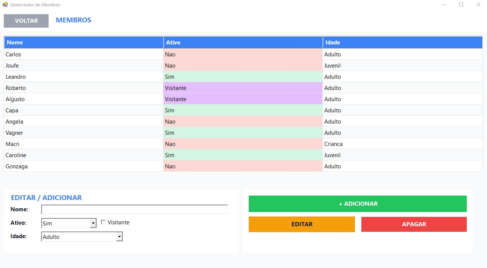
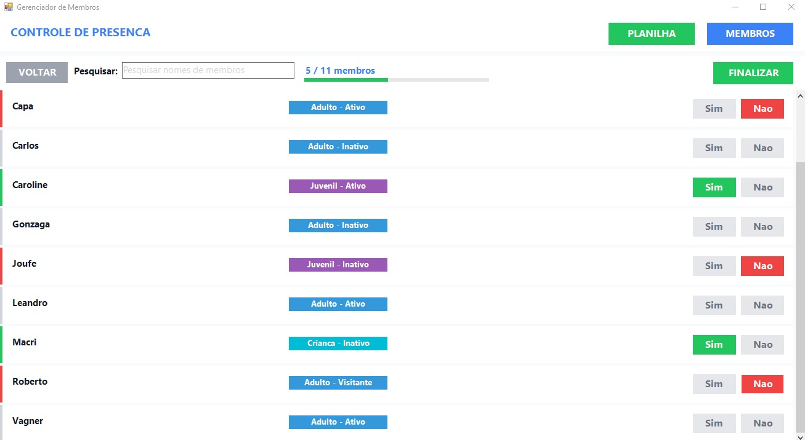

<h1 align="center">Event Presence Analyzer</h1>

  <strong>Projeto universitário para digitalizar o registro de membros e sua participação em eventos de uma igreja local.</strong>

## Visão geral

A university project developed to digitize the record of members and their participation in events at a local church, generating reports in spreadsheets. The project’s logic was written entirely in C, with the interface created using a PowerShell application.

## Tecnologias utilizadas

- **C** — lógica principal do sistema
- **PowerShell** — interface do aplicativo
- **Planilhas** — geração dos relatórios

## Capturas de tela

  
  

